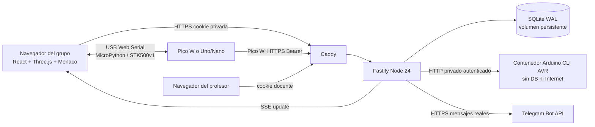

# Arquitectura del taller

El frontend sirve seis actividades esenciales de 60 minutos y una biblioteca de 33 actividades por etapas. Catorce bloques pedagógicos se presentan en cinco fases: entiende, conecta, programa, experimenta y comprueba. Catálogo y ruta comparten `web/content/`; progreso y borradores mantienen los IDs anteriores cuando corresponde. Editor y escenas se cargan al usarse. Los SVG SoyTEL y la escena viva usan identidad bosque/lima/cian con temas claro/oscuro.

El montaje tiene un único modelo físico (`web/circuit/`): agujeros, tiras conductoras, pines físicos de la Pico, piezas, resistencias y cables. SVG y Three.js leen ese modelo; el guía confirma acciones críticas y avanza una conexión a la vez. La cámara se adapta al canvas y al circuito. Los flujos animados son ilustraciones educativas identificadas; las lecturas reales proceden exclusivamente de la API o del USB. Las escenas se pausan fuera de pantalla, al ocultar la pestaña o por preferencia de movimiento reducido. WebGL dispone de alternativa textual/2D.

El navegador ejecuta y modifica MicroPython mediante el REPL real de la Pico; instala módulos desde el servidor y guarda la configuración de su propia estación. Arduino se compila con AVR-GCC por Arduino CLI y se sube al bootloader con Web Serial. El programa se ejecuta únicamente en la placa física.

El puente USB usa `/api/bridge/connect` y `/api/bridge/ingest`: cookie HttpOnly del grupo y origen autorizado, sin token de dispositivo en JavaScript. El servidor deriva el grupo de la cookie y limita dispositivos activos. Las líneas JSON consecutivas se combinan por sensor antes de publicar; un Wi-Fi activo con IP y TLS confirmado evita duplicar las muestras que la Pico ya publica. La revocación impide ingresar nuevos datos hasta reconectar. La credencial de instalación Pico permanece sólo en memoria y se reutiliza hasta revocarla.

Actualizaciones y recuperación de sesión se serializan en el cliente. La cola offline combina borradores, calibraciones y habilitaciones de manera parcial; un nuevo cambio reemplaza al anterior para la misma clave. Antes de confirmar un PATCH se incluye la cola pendiente, y sólo entonces se limpia. El servidor reconsulta el estado vigente antes de combinar el cambio para no escribir un snapshot previo de la sesión. `lastRun` conserva el último código ejecutado del propio grupo.

El firmware separa drivers y diagnóstico de la lógica de publicación. Los sensores del inventario se leen con sus unidades, raw, estado y error disponible. La calibración transforma ADC en porcentajes relativos; conserva los puntos húmedo/seco por sesión y los aplica al generar la configuración. El firmware de Pico W maneja Wi-Fi, HTTPS, emparejamiento y reconexión. Una Uno/Nano no incorpora red, por lo que su telemetría pasa por el puente USB del navegador. Un flujo de simulación educativo opcional registra explícitamente su origen.

La API implementa el contrato de [IMPLEMENTATION_CONTRACT.md](IMPLEMENTATION_CONTRACT.md). Todas las tablas de datos llevan `session_id`; los IDs recibidos nunca sustituyen la sesión autenticada. `sessions` guarda progreso, código y calibración; `devices` guarda tokens hasheados y diagnósticos; `readings` contiene telemetría canónica con timestamp de servidor; `rules` y `rule_states` conservan la máquina de estados de umbrales; `alerts` incluye su entrega; `settings` conserva Telegram cifrado. Las claves foráneas eliminan toda la información de una sesión borrada.

Una alerta baja se recupera al alcanzar `min+hysteresis`; una alta, al bajar a `max-hysteresis`. El cooldown limita repeticiones de una misma condición, no bloquea un cambio real de condición ni su recuperación. Los estados se separan por regla, dispositivo y origen para que una simulación no recupere una alarma de hardware. `NO_RESPONSE`, `ERROR` y `OUT_OF_RANGE` generan fallo cuando hay un umbral para ese sensor; `DISABLED`, `NEEDS_CALIBRATION` y `UNVERIFIED` sin valor no se presentan como alarma. Una ausencia analógica no verificable no se convierte en detección falsa. Sin umbral los fallos siguen visibles en el dashboard, pero no generan mensajes Telegram.

SSE sólo emite avisos `update`, con heartbeat cada quince segundos. El cliente reconsulta su dashboard autorizado; ningún evento transmite datos ajenos. Una estación aparece online durante dos minutos desde la última publicación y se marca revocada/offline según corresponda. Una auditoría cada veinte segundos registra `DEVICE_OFFLINE` si una estación que ya publicó hardware supera ese plazo; registra `DEVICE_RECOVERY` al volver a recibir telemetría. Sus transiciones se guardan atómicamente en `device_monitor`, sobreviven al reinicio y producen un único aviso por transición. No hay alarmas de dispositivo para simulación, tokens revocados o dispositivos que aún no publicaron su primera muestra. `DEVICE_OFFLINE_SECONDS` y `DEVICE_AUDIT_SECONDS` permiten configurar ambos plazos. Esto distingue una conexión perdida de un diagnóstico físico; no se inventa detección de cables desconectados.

La base ejecuta transacciones para ingreso de muestras y consumo de códigos de un uso. WAL y busy timeout permiten lecturas durante escrituras en la única instancia. El historial del dashboard se limita a 5.000 lecturas; CSV transmite toda la serie retenida como stream. Los borradores y calibraciones se actualizan parcialmente y permanecen entre reinicios. La sesión de grupo vence a los siete días por defecto, la de profesor a las ocho horas y los datos antiguos se eliminan cada hora conforme a retención.

La entrega Telegram usa una cola persistente en `alerts.delivery=pending`; se envía un mensaje cada vez con tres intentos. Un reinicio retoma pendientes. La entrega es al menos una vez: si el proceso cae después de que Telegram acepta y antes de persistir el resultado, podría repetirse un mensaje. No se almacenan SSID/contraseña Wi-Fi ni tokens de dispositivos en respuestas de exportación. La configuración final de placa se genera en el navegador.

La arquitectura propuesta para producción es [Compose con HTTPS](DEPLOYMENT.md). No requiere una cuenta cloud adicional; la instancia HTTPS actúa como endpoint remoto de telemetría. Las pruebas están separadas entre API, transporte/modelos y drivers Python. Un resultado automático no certifica el cableado real: se mantiene una validación manual con el kit antes del taller.
